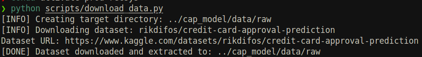
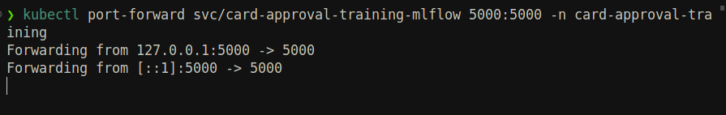
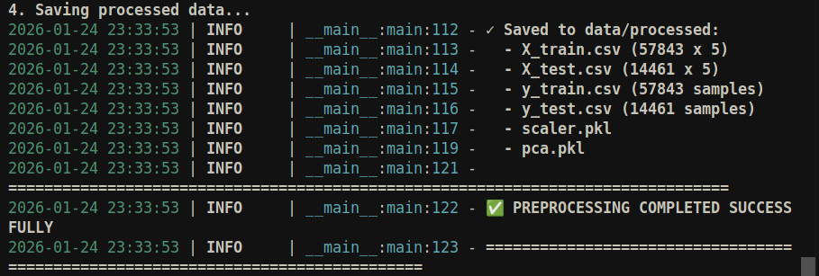
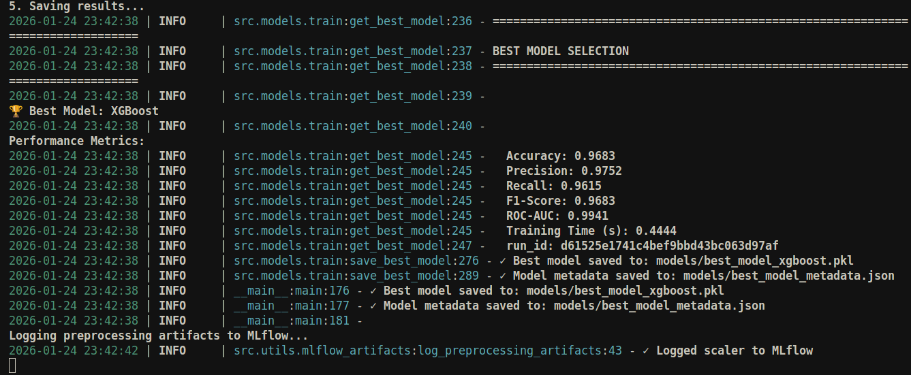
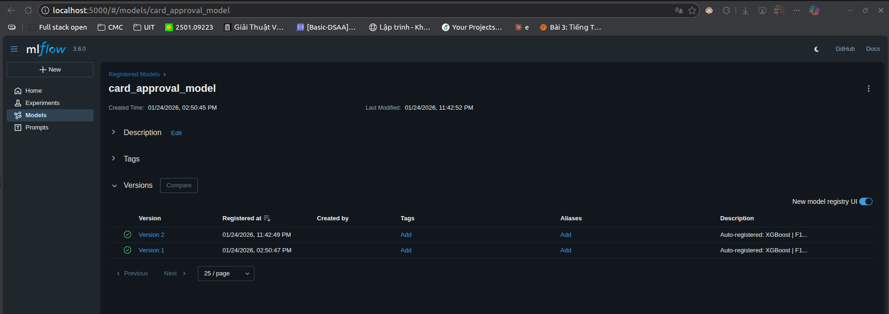

# Model Training Guide

Train credit card approval models with MLflow tracking.

> **Prerequisites:**
> - MLflow deployed and running (see [01_Helm_Deployment.md](01_Helm_Deployment.md))
> - Kaggle API credentials configured

---

## Overview

The training pipeline:
1. Downloads credit card data from Kaggle
2. Preprocesses features (encoding, scaling, PCA)
3. Trains multiple models (XGBoost, LightGBM, CatBoost, etc.)
4. Logs metrics and artifacts to MLflow
5. Registers best model to MLflow Model Registry

---

## Step 1: Setup Kaggle API

```bash
# Create Kaggle directory
mkdir -p ~/.kaggle
chmod 600 ~/.kaggle

# Get API key from https://www.kaggle.com/settings → API → Create New Token
# Move downloaded kaggle.json to ~/.kaggle/
mv ~/Downloads/kaggle.json ~/.kaggle/
chmod 600 ~/.kaggle/kaggle.json

# Verify
kaggle --version
```

## Step 2: Download Data

```bash
cd training
python scripts/download_data.py
```


**Expected output:**
```
data/
├── raw/
│   ├── application_record.csv   # 438,557 rows
│   └── credit_record.csv        # 1,048,575 rows
```


---

## Step 3: Connect to MLflow


```bash
kubectl port-forward svc/card-approval-training-mlflow 5000:5000 -n card-approval-training
```
**Terminal**


## Step 4: Preprocess Data

```bash
cd training
python scripts/run_preprocessing.py
```

**Output:**
```
data/processed/
├── X_train.csv, X_test.csv
├── y_train.csv, y_test.csv
├── scaler.pkl, pca.pkl
└── feature_names.json
```
**Terminal**



---

## Step 5: Train Models

```bash
cd training
python scripts/run_training.py
```

**What happens:**
1. Trains: XGBoost, LightGBM, CatBoost, AdaBoost, NaiveBayes
2. Logs metrics & artifacts to MLflow
3. Registers best model (by F1-Score) to MLflow Model Registry
4. Stores model and preprocessor artifacts in GCS bucket (configured in Helm deployment)

---

**Terminal**


**MLflow**


## Step 6: Verify in MLflow

Open http://localhost:5000

- **Experiments**: View all training runs
- **Models**: Check `card_approval_model`

---

## Next Steps

Now that your model is trained and promoted to Production:

1. **[Continue Helm Deployment](01_Helm_Deployment.md#step-3-deploy-application-stacks)** - Deploy the API with the trained model
